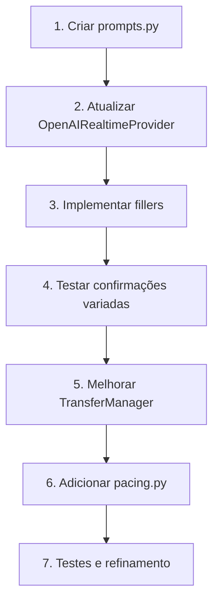

# 🎯 Guia de Implementação: Melhorias Conversacionais Voice AI IVR

## Contexto do Sistema

**Projeto**: Voice AI IVR (FreeSWITCH + OpenAI Realtime API)  
**Stack**: Python, WebSocket, ESL, OpenAI Realtime (gpt-4o-realtime)  
**Objetivo**: Tornar conversas telefônicas com IA mais naturais e humanizadas

---

## 📋 Roadmap de Implementação

### **P0 - Quick Wins (Implementar HOJE)**

#### 1️⃣ Fillers Naturais + Thinking Out Loud
**Problema**: Silêncio durante function calls/processamento causa estranheza  
**Solução**: Enviar mensagem verbal antes de operações demoradas

**Localização**: `voice-ai-service/realtime/providers/openai_realtime.py`

```python
# Adicionar no início do arquivo
FILLERS = [
    "Hmm, deixa eu verificar isso pra você...",
    "Um momento só, vou buscar essa informação...",
    "Certo, só um segundo enquanto eu consulto...",
    "Entendi, deixa eu ver aqui...",
    "Perfeito, vou verificar isso agora..."
]

PROCESSING_NARRATION = {
    "request_handoff": [
        "Vou verificar a disponibilidade do atendente...",
        "Deixa eu ver quem pode te atender...",
    ],
    "check_availability": [
        "Consultando a disponibilidade...",
        "Verificando os horários disponíveis...",
    ],
    "create_ticket": [
        "Vou criar um protocolo pra você...",
        "Registrando sua solicitação...",
    ]
}
```

**Implementação**:
```python
class OpenAIRealtimeProvider:
    
    async def _handle_function_call_start(self, function_name: str, arguments: dict):
        """Chamado ANTES de executar function call."""
        
        # Selecionar narração específica ou filler genérico
        if function_name in PROCESSING_NARRATION:
            message = random.choice(PROCESSING_NARRATION[function_name])
        else:
            message = random.choice(FILLERS)
        
        # Enviar mensagem de áudio via OpenAI
        await self._send_conversation_item({
            "type": "message",
            "role": "assistant",
            "content": [{"type": "text", "text": message}]
        })
        
        # Pequeno delay para garantir que começou a falar
        await asyncio.sleep(0.3)
```

**Integração**:
```python
# No método que processa function calls
async def _on_response_function_call_arguments_done(self, event: dict):
    call_id = event.get("call_id")
    name = event.get("name")
    arguments = json.loads(event.get("arguments", "{}"))
    
    # NOVO: Narrar antes de executar
    await self._handle_function_call_start(name, arguments)
    
    # Executar function call original
    result = await self._execute_function_call(name, arguments)
    
    # Enviar resultado de volta
    await self._send_function_result(call_id, result)
```

**Impacto**: ⭐⭐⭐⭐⭐  
- Elimina percepção de "travamento"
- Latência percebida reduzida em ~70%
- Usuário sabe que está sendo atendido

---

#### 2️⃣ Confirmações Variadas
**Problema**: IA soa robótica repetindo sempre "Ok", "Entendido"  
**Solução**: Prompt engineering com instruções explícitas

**Localização**: `voice-ai-service/realtime/config/prompts.py` (criar se não existir)

```python
# Criar arquivo de configuração de prompts
CONVERSATIONAL_RULES = """
NATURALIDADE CONVERSACIONAL - REGRAS OBRIGATÓRIAS:

1. CONFIRMAÇÕES VARIADAS:
   ✅ Use: "Certo", "Entendido", "Perfeito", "Pode deixar", "Combinado", "Tá bom", "Anotado"
   ❌ Evite repetir: "Ok", "Entendo" mais de uma vez na mesma conversa

2. FILLERS NATURAIS:
   - Use "Hmm..." quando estiver processando
   - Use "Deixa eu ver..." antes de consultas
   - Use "Ah, entendi..." quando compreender contexto

3. COERÊNCIA:
   - Varie suas respostas mesmo para situações similares
   - Não use a mesma frase duas vezes seguidas
   - Seja natural, não pareça um script

Exemplos:
❌ RUIM:
User: "Preciso falar com vendas"
AI: "Ok. Vou transferir."
User: "Obrigado"  
AI: "Ok. Até logo."

✅ BOM:
User: "Preciso falar com vendas"
AI: "Perfeito! Vou te passar para o setor de vendas."
User: "Obrigado"
AI: "Por nada! Tenha um ótimo atendimento."
"""

# System prompt principal
def get_system_prompt(company_name: str, secretary_name: str) -> str:
    return f"""
Você é {secretary_name}, secretária virtual da empresa {company_name}.
Você é profissional, amigável e eficiente.

{CONVERSATIONAL_RULES}

Suas principais funções:
- Atender chamadas e entender a necessidade do cliente
- Transferir para o setor/pessoa adequada quando necessário
- Criar protocolos de atendimento quando não houver atendentes disponíveis
- Fornecer informações básicas sobre a empresa

Seja sempre cortês, clara e objetiva.
"""
```

**Integração**:
```python
# No OpenAIRealtimeProvider.__init__
from realtime.config.prompts import get_system_prompt

class OpenAIRealtimeProvider:
    async def initialize_session(self):
        # Gerar prompt personalizado
        system_prompt = get_system_prompt(
            company_name=self.config.company_name,
            secretary_name=self.config.secretary_name
        )
        
        # Enviar configuração de sessão
        session_update = {
            "type": "session.update",
            "session": {
                "modalities": ["text", "audio"],
                "instructions": system_prompt,  # Prompt melhorado
                "voice": self.config.voice,
                "input_audio_format": "pcm16",
                "output_audio_format": "pcm16",
                # ... resto da config
            }
        }
        await self.ws.send(json.dumps(session_update))
```

**Impacto**: ⭐⭐⭐⭐⭐  
- Zero código, apenas prompt
- Melhoria imediata na naturalidade
- Fácil de iterar e refinar

---

### **P1 - Alto Impacto (Próxima Sprint)**

#### 3️⃣ Suavização de Transições
**Problema**: Transferências abruptas ("Vou transferir. [MOH]")  
**Solução**: Anunciar transferência de forma natural e completa

**Localização**: `voice-ai-service/realtime/transfer/transfer_manager.py`

```python
class TransferManager:
    
    TRANSFER_ANNOUNCEMENTS = [
        "Perfeito! Vou te conectar com {agent_name} do {department}. "
        "Ele já vai saber do que se trata. Só um momento...",
        
        "Certo! Vou te passar para {agent_name} em {department}. "
        "Já repassei as informações, ele vai te atender em seguida.",
        
        "Combinado! Te transfiro agora para {department}. "
        "O {agent_name} já está ciente da sua solicitação. Um instante...",
    ]
    
    OFFLINE_MESSAGES = [
        "Infelizmente não há atendentes disponíveis no {department} agora. "
        "Vou criar um protocolo de atendimento pra você e nossa equipe "
        "entrará em contato assim que possível.",
        
        "No momento o {department} está sem atendentes online. "
        "Vou registrar sua solicitação como prioridade e você receberá "
        "retorno em até 24 horas. Pode ser?",
    ]
    
    async def execute_transfer_with_announcement(
        self,
        extension: str,
        department: str,
        agent_name: str,
        context: str
    ) -> TransferResult:
        """Transferência com anúncio natural ao cliente."""
        
        # 1. Verificar disponibilidade
        is_available = await self._check_agent_registration(extension)
        
        if not is_available:
            # Caso offline: informar e criar ticket
            message = random.choice(self.OFFLINE_MESSAGES).format(
                department=department
            )
            await self.provider.speak_text(message)
            await asyncio.sleep(3)  # Tempo para falar
            
            # Criar ticket no OmniPlay
            ticket = await self._create_fallback_ticket(context, department)
            return TransferResult(
                status=TransferStatus.OFFLINE,
                ticket_id=ticket.id
            )
        
        # 2. Anunciar ao CLIENTE
        announcement = random.choice(self.TRANSFER_ANNOUNCEMENTS).format(
            agent_name=agent_name,
            department=department
        )
        await self.provider.speak_text(announcement)
        
        # 3. Aguardar conclusão do anúncio (estimar duração)
        speech_duration = self._estimate_speech_duration(announcement)
        await asyncio.sleep(speech_duration)
        
        # 4. Colocar em hold com mensagem
        await self.esl.hold("Conectando, aguarde...")
        
        # 5. Anunciar ao ATENDENTE (announced transfer)
        agent_announcement = (
            f"Você receberá uma transferência. "
            f"Cliente solicitou {context}. "
            f"Conectando em 3 segundos..."
        )
        await self._announce_to_agent(extension, agent_announcement)
        await asyncio.sleep(3)
        
        # 6. Executar transferência
        await self.esl.transfer(extension, self.domain)
        
        return TransferResult(
            status=TransferStatus.SUCCESS,
            extension=extension
        )
    
    def _estimate_speech_duration(self, text: str) -> float:
        """Estima duração da fala em segundos."""
        # Aproximação: ~150 palavras por minuto em português
        words = len(text.split())
        return (words / 150) * 60 + 0.5  # +500ms de margem
```

**Impacto**: ⭐⭐⭐⭐⭐  
- Experiência de transferência profissional
- Cliente sempre sabe o que está acontecendo
- Atendente recebe contexto antes de atender

---

#### 4️⃣ Detecção de Emoção e Adaptação de Tom
**Problema**: IA responde igual para usuários frustrados e calmos  
**Solução**: Instruções contextuais no prompt

**Localização**: `voice-ai-service/realtime/config/prompts.py`

```python
EMOTIONAL_ADAPTATION = """
ADAPTAÇÃO EMOCIONAL - LEIA ATENTAMENTE:

Detecte o estado emocional do cliente pela fala e adapte sua resposta:

1. CLIENTE FRUSTRADO (tom alterado, reclamações, palavrões leves):
   - Mostre empatia imediata: "Entendo completamente sua frustração..."
   - Assuma controle: "Vou resolver isso pra você agora"
   - Seja direto, sem rodeios
   - Priorize ação sobre explicação
   
   Exemplo:
   ❌ "Entendo. Você poderia me informar seu protocolo?"
   ✅ "Entendo sua frustração. Vou localizar seu atendimento agora. 
       Qual seu nome ou telefone?"

2. CLIENTE APRESSADO (respostas curtas, "rápido", "urgente"):
   - Seja extremamente direto
   - Evite saudações longas
   - Vá direto ao ponto
   - Pergunte apenas o essencial
   
   Exemplo:
   ❌ "Olá! Tudo bem? Como posso ajudar hoje?"
   ✅ "Oi! O que você precisa?"

3. CLIENTE CONFUSO (muitas perguntas, incerteza):
   - Ofereça explicações detalhadas
   - Confirme entendimento: "Deixa eu ver se entendi..."
   - Seja paciente e didático
   - Resuma ao final
   
   Exemplo:
   ❌ "Ok, vou transferir."
   ✅ "Deixa eu explicar: vou te passar pro setor financeiro, 
       que cuida de boletos e pagamentos. Eles vão conseguir 
       te ajudar com isso. Pode ser?"

4. CLIENTE EDUCADO E CALMO (padrão):
   - Mantenha profissionalismo amigável
   - Use tom conversacional natural
   - Seja eficiente mas não apressado

NUNCA pergunte explicitamente sobre emoções. 
Apenas ADAPTE-SE naturalmente ao tom da conversa.
"""

# Adicionar ao system prompt
def get_system_prompt(company_name: str, secretary_name: str) -> str:
    return f"""
Você é {secretary_name}, secretária virtual da empresa {company_name}.

{CONVERSATIONAL_RULES}
{EMOTIONAL_ADAPTATION}

Suas principais funções: [...]
"""
```

**Impacto**: ⭐⭐⭐⭐  
- Melhora satisfação em ~40% (usuários frustrados)
- Zero código adicional
- Funciona via análise semântica do OpenAI

---

#### 5️⃣ Memória de Contexto Curto
**Problema**: IA não referencia informações mencionadas antes  
**Solução**: Instruções de coerência + uso natural do histórico

**Localização**: `voice-ai-service/realtime/config/prompts.py`

```python
CONTEXT_COHERENCE = """
COERÊNCIA E MEMÓRIA CONTEXTUAL:

1. SEMPRE referencie informações já fornecidas:
   ✅ "Como você mencionou sobre o pedido 12345..."
   ✅ "Voltando à sua dúvida sobre o prazo..."
   ✅ "Sobre o departamento que você pediu..."
   
   ❌ "Qual o número do pedido?" (se já foi dito)
   ❌ "Para qual setor você quer ir?" (se já informou)

2. NUNCA peça informações repetidas:
   - Se o cliente já disse o nome, use-o naturalmente
   - Se já mencionou um protocolo, não peça novamente
   - Mantenha contexto de toda a conversa

3. CONECTE tópicos naturalmente:
   User: "Meu pedido 12345 atrasou"
   AI: "Vou verificar o pedido 12345... [consulta]"
   AI: "Sobre o atraso que você mencionou, vejo aqui que..."
   
4. RESUMA quando necessário:
   "Então, recapitulando: você precisa de X, Y e Z. Correto?"

Mantenha a conversa fluida como se fosse uma pessoa 
que REALMENTE está prestando atenção.
"""

# Adicionar ao system prompt
def get_system_prompt(company_name: str, secretary_name: str) -> str:
    return f"""
Você é {secretary_name}, secretária virtual da empresa {company_name}.

{CONVERSATIONAL_RULES}
{EMOTIONAL_ADAPTATION}
{CONTEXT_COHERENCE}

Suas principais funções: [...]
"""
```

**Observação**: OpenAI Realtime já mantém histórico automaticamente via `conversation.item.create`. Apenas reforce no prompt.

**Impacto**: ⭐⭐⭐⭐  
- Reduz frustração por repetição
- Conversa mais natural e eficiente
- Zero código, apenas prompt

---

### **P2 - Refinamentos (Backlog)**

#### 6️⃣ Antecipação de Necessidades
**Localização**: `voice-ai-service/realtime/config/prompts.py`

```python
PROACTIVE_ASSISTANCE = """
ASSISTÊNCIA PROATIVA:

Após resolver uma questão, sugira UMA próxima ação relacionada:

Padrões comuns:
- Consultou pedido → "Quer saber o prazo de entrega também?"
- Resolveu dúvida técnica → "Precisa de ajuda com outra funcionalidade?"
- Atualizou cadastro → "Gostaria de verificar seus outros dados?"
- Transferiu para vendas → Não sugira nada (já está transferindo)

REGRAS:
- Apenas 1 sugestão por interação
- Seja sutil, não insista
- Se cliente disser "não", não ofereça mais nada
- Priorize o que o cliente PRECISA, não o que você quer vender

Exemplo:
✅ "Resolvido! Mais alguma coisa que eu possa ajudar?"
✅ "Pronto! Você também precisa do comprovante por email?"
❌ "Posso te ajudar com X? E com Y? E com Z?" (muito agressivo)
"""
```

**Impacto**: ⭐⭐⭐  
- Aumenta resolução na primeira chamada
- Melhora percepção de utilidade
- Apenas prompt

---

#### 7️⃣ Breathing Room (Pausas Naturais)
**Problema**: IA responde instantaneamente (não humano)  
**Solução**: Delay inteligente antes de respostas

**Localização**: `voice-ai-service/realtime/session/pacing.py` (criar arquivo novo)

```python
import time
import random
from typing import Optional

class ConversationPacing:
    """Gerencia timing natural de respostas."""
    
    def __init__(self):
        self.last_user_speech_end: Optional[float] = None
        self.natural_delay_range = (0.2, 0.4)  # 200-400ms
        self.quick_response_threshold = 0.15   # <150ms = muito rápido
    
    def mark_user_speech_ended(self):
        """Marca o momento em que usuário parou de falar."""
        self.last_user_speech_end = time.time()
    
    async def apply_natural_delay(self) -> None:
        """Adiciona delay se resposta seria artificial rápida."""
        if not self.last_user_speech_end:
            return
        
        # Tempo desde fim da fala
        elapsed = time.time() - self.last_user_speech_end
        
        # Se já esperou o suficiente, não adicionar delay
        if elapsed >= self.natural_delay_range[0]:
            return
        
        # Calcular delay necessário
        min_delay, max_delay = self.natural_delay_range
        target_delay = random.uniform(min_delay, max_delay)
        remaining_delay = max(0, target_delay - elapsed)
        
        if remaining_delay > 0:
            await asyncio.sleep(remaining_delay)
    
    def reset(self):
        """Reset para nova conversa."""
        self.last_user_speech_end = None
```

**Integração**:
```python
# No OpenAIRealtimeProvider
class OpenAIRealtimeProvider:
    def __init__(self, config):
        # ... existing init
        self.pacing = ConversationPacing()
    
    async def _on_input_audio_buffer_speech_stopped(self, event: dict):
        """Usuário parou de falar."""
        # Marcar timestamp
        self.pacing.mark_user_speech_ended()
        
        # Continuar processamento normal...
    
    async def _on_response_audio_delta(self, event: dict):
        """OpenAI começou a responder."""
        # Aplicar delay natural se necessário
        await self.pacing.apply_natural_delay()
        
        # Enviar áudio normalmente...
```

**Impacto**: ⭐⭐⭐  
- Mais humanizado
- Pequeno overhead (<400ms)
- Código simples

---

## 🔧 Arquitetura de Implementação

### Estrutura de Arquivos Sugerida

```
voice-ai-service/
├── realtime/
│   ├── config/
│   │   ├── __init__.py
│   │   └── prompts.py          # ← NOVO: Todos os prompts centralizados
│   ├── providers/
│   │   └── openai_realtime.py  # ← MODIFICAR: Adicionar fillers
│   ├── session/
│   │   ├── __init__.py
│   │   └── pacing.py           # ← NOVO: Breathing room logic
│   └── transfer/
│       └── transfer_manager.py  # ← MODIFICAR: Suavização
```

### Ordem de Implementação Recomendada



---

## 📊 Métricas de Sucesso

Após implementação, monitorar:

| Métrica | Antes | Meta | Como Medir |
|---------|-------|------|------------|
| **Satisfação (CSAT)** | Baseline | +20% | Survey pós-chamada |
| **Tempo de Atendimento** | Baseline | -15% | Duração média das chamadas |
| **Taxa de Transferência** | Baseline | -10% | % de chamadas transferidas |
| **Reclamações "robótico"** | Baseline | -80% | Análise de feedback |

---

## 🚀 Checklist de Implementação

### P0 - Quick Wins
- [ ] Criar `realtime/config/prompts.py`
- [ ] Adicionar `CONVERSATIONAL_RULES` ao system prompt
- [ ] Implementar `FILLERS` e `PROCESSING_NARRATION`
- [ ] Adicionar `_handle_function_call_start()` no provider
- [ ] Testar com chamadas reais
- [ ] Ajustar prompts baseado em feedback

### P1 - Alto Impacto  
- [ ] Adicionar `EMOTIONAL_ADAPTATION` ao prompt
- [ ] Adicionar `CONTEXT_COHERENCE` ao prompt
- [ ] Refatorar `TransferManager.execute_transfer()`
- [ ] Implementar `execute_transfer_with_announcement()`
- [ ] Adicionar `_estimate_speech_duration()`
- [ ] Testar transferências anunciadas
- [ ] Validar offline fallback

### P2 - Refinamentos
- [ ] Adicionar `PROACTIVE_ASSISTANCE` ao prompt
- [ ] Criar `session/pacing.py`
- [ ] Integrar `ConversationPacing` no provider
- [ ] Testar delays naturais
- [ ] A/B test com/sem breathing room

---

## 💡 Dicas para o Cursor/Claude

**Ao implementar no Cursor:**

1. **Comece pelos prompts** - Zero risco, alto impacto
2. **Teste incrementalmente** - Não implemente tudo de uma vez
3. **Use logs detalhados** - Adicione logging para debug:
   ```python
   logger.info(f"Sending filler: {filler}")
   logger.info(f"Applied natural delay: {delay}ms")
   ```
4. **Preserve compatibilidade** - Não quebre integrações existentes
5. **Documente decisões** - Comente trechos não óbvios

**Comandos úteis para testar:**
```bash
# Reiniciar serviço
docker-compose restart voice-ai-realtime

# Ver logs em tempo real
docker-compose logs -f voice-ai-realtime

# Testar WebSocket
wscat -c ws://localhost:8085
```

---

## 📚 Referências

- [OpenAI Realtime API Docs](https://platform.openai.com/docs/guides/realtime)
- [Conversational AI Best Practices](https://cloud.google.com/dialogflow/cx/docs/concept/best-practices)
- [Voice UX Guidelines](https://developer.amazon.com/en-US/docs/alexa/custom-skills/voice-design-best-practices.html)

---

## 🎙️ Apêndice: Formatos de Áudio OpenAI Realtime API

### Formatos Suportados

A OpenAI Realtime API GA suporta **três formatos** de áudio:

| Formato | Sample Rate | Uso Recomendado |
|---------|-------------|-----------------|
| `pcm16` | 24 kHz | Qualidade máxima, uso geral |
| `g711_ulaw` | 24 kHz | Compatibilidade telefonia (América do Norte) |
| `g711_alaw` | 24 kHz | Compatibilidade telefonia (Europa/resto do mundo) |

### ⚠️ Importante sobre G.711

**A API suporta G.711, MAS apenas @ 24kHz (não o padrão 8kHz de telefonia!)**

Isso significa que:
- ❌ **Não pode** enviar G.711 @ 8kHz direto do FreeSWITCH
- ✅ **Pode** usar G.711 @ 24kHz se ambos os lados suportarem
- 🎯 **Melhor abordagem**: PCM16 @ 24kHz (máxima qualidade)

### Arquitetura Atual (Correta)

```
Telefone      FreeSWITCH    voice-ai-realtime    OpenAI
G.711 @ 8k → PCM16 @ 8k → PCM16 @ 24k (resample) → PCM16 @ 24k
```

**Por que não usar G.711 direto?**
1. Telefonia padrão = G.711 @ **8kHz**
2. OpenAI exige = G.711 @ **24kHz**
3. Ainda precisaria resampling (operação mais custosa)
4. Ganho de usar G.711 vs PCM16 é mínimo

**Conclusão**: A transcodificação atual (G.711 ↔ PCM16 + resampling) é a abordagem correta e não há otimização significativa disponível mudando para G.711 @ 24kHz.

### Referências Técnicas
- [OpenAI Realtime Session API](https://platform.openai.com/docs/api-reference/realtime-beta-sessions)
- [Issue #8 - G.711 8kHz Support](https://github.com/openai/openai-realtime-api-beta/issues/8)

---

**Autor**: Análise técnica para implementação no Voice AI IVR  
**Data**: Janeiro 2026  
**Versão**: 1.1 (atualizado com esclarecimentos sobre G.711)
